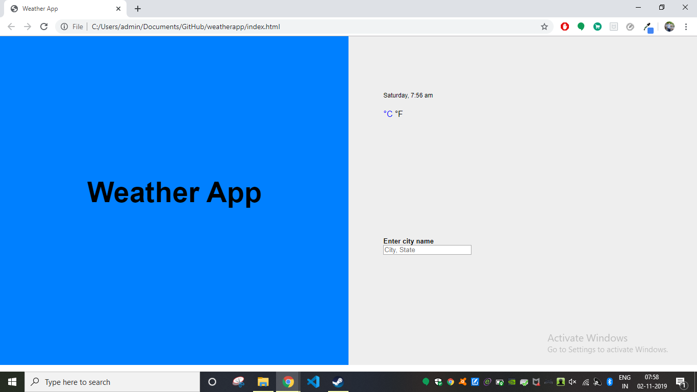

# Weather App V 1.0.0

Weather is one of the major factors that affects our day-to-day routine. Starting from a good morning till a lovely night, weather plays an important role. There are tonnes of methods to forecast this weather but only a few brings the result whenever and wherever we want. This project is such a web application, designed to give the forecasted weather result to the end user.

## Getting Started

Follow steps below to download and run this project in local machine
1. Click on 'Clone or download'
2. CLick 'Download ZIP'
3. Extract the .zip file to the preferred location.

### Prerequisites

* html
* css
* javascript

## Working

1. Open the index.html to start the application

2. Click on the messages button to open the messages screen.

3. Double click on the small icon on the top left corner to go back to Home screen.

4. Click on the music button to open music screen.

5. Click on the clock button to open the time screen.

6. Click on the clock button to see time.

7. Click on the Stopwatch button to open stop watch.

8.CLickon the start button to start, stop to stop and lap button to count lap.

## Author

[**Ajith C Ravi**](https://github.com/ajithcravi)
